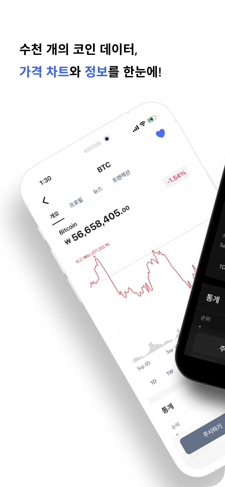
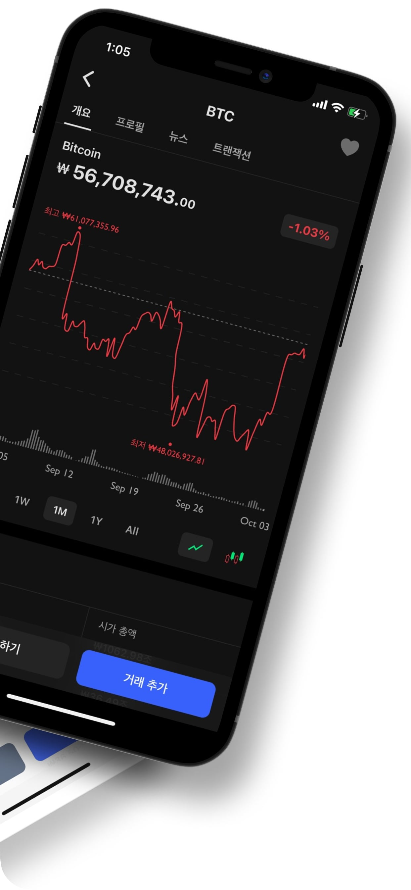
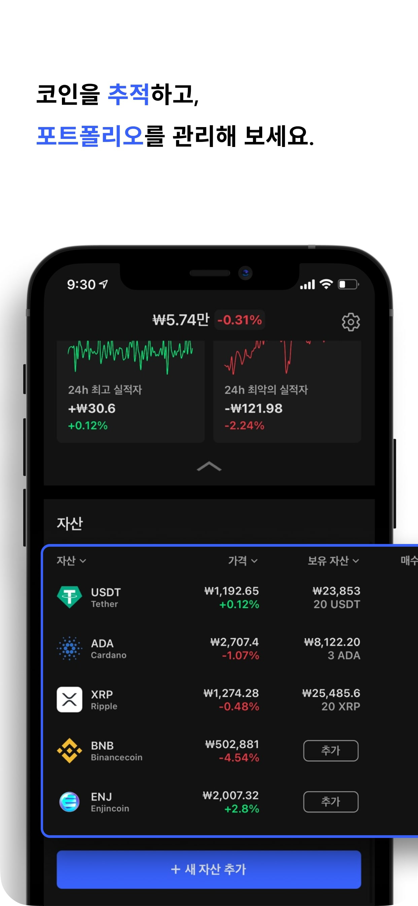
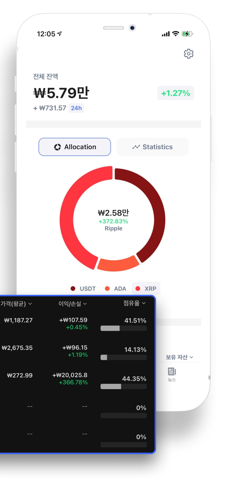
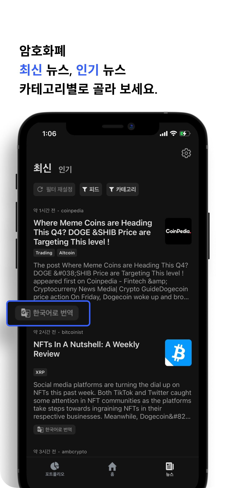

    
    
 
        Bitfolio 
    

----------------------------------------
    Bitfolio는 가상 화폐 투자에 관심이 있거나, 전 세계 10,000개 이상의 코인에 대한 정보를 얻고자 하는 사용자를 위한 앱입니다.

    
    
    
    
    

 

Bitfolio가 제공하는 주요 기능은 다음과 같습니다.
1. 다양한 코인 정보 확인
    - 수천 개의 코인 가격 차트, 정보, 관련 뉴스 등을 제공합니다.
2. 코인추적과 포트폴리오 관리
    - 무료로 코인을 추적하고, 모의 투자하며 포트폴리오를 관리해 볼 수 있습니다.
3. 암호화폐관련 뉴스 확인
    - 제공 출처와 카테고리별로 보고싶은 뉴스를 손쉽게 확인하실 수 있습니다.
    - 뉴스의 언어가 사용자의 설정에 따른 언어로 번역할 수 있는 버튼을 제공합니다.
4. 사용자 편의성 기능
    - 언어 한국어 / 영어를 제공하고 있습니다.
    - 어두운 곳에서도 편안하게 사용할 수 있도록 다크모드를 지원하고 있습니다.
    - 최대 3개의 법정화폐 설정을 제공하고 있습니다.
    - 최초 앱 실행 시 실행 화면을 설정하실 수 있습니다.

### 향후 업데이트 방향 대표 3가지
1. 자체 서버를 만들어 앱내 가상 화폐 커뮤니티 생성
2. portfolio 가격 | 수익률 차트 생성
3. 국내 유명 거래소별 가상 화폐 가격 제공

## Bitfolio 사용하기

현재 IOS 모바일 기기로 사용해 보실 수 있습니다.

| iOS |
|:-:|
|  |

## 프로젝트 스택
다음 항목은 이 프로젝트에 사용된 핵심 프론트엔드 기술입니다.
* Expo & React-Native
* react navigation v5
* SWR
* Redux
* styled-components
* d3
* i18next
* react-native-reanimated
* Typescript

## APIs

+ 가상 화폐 대부분의 데이터는 [coingecko](https://www.coingecko.com/ko/api "coingecko api")에서 제공받고 있습니다.
+ 가상 화폐 관련 뉴스 데이터는 [cryptocompare](https://min-api.cryptocompare.com/ "cryptocompare api")에서 제공받고 있습니다.

## Etc.
가상 화폐 투자 포트폴리오에서의 이익/손실, 점유율, 전체 잔액 등의 통계 계산식은 [여기서](./FOMULA.md) 확인하실 수 있습니다.
## 프로젝트 설치 및 실행 방법

Bitfolio를 개인 로컬 환경에 실행을 원하시면 [안내 문서](./GUIDELINES.md)를 확인하십시오.